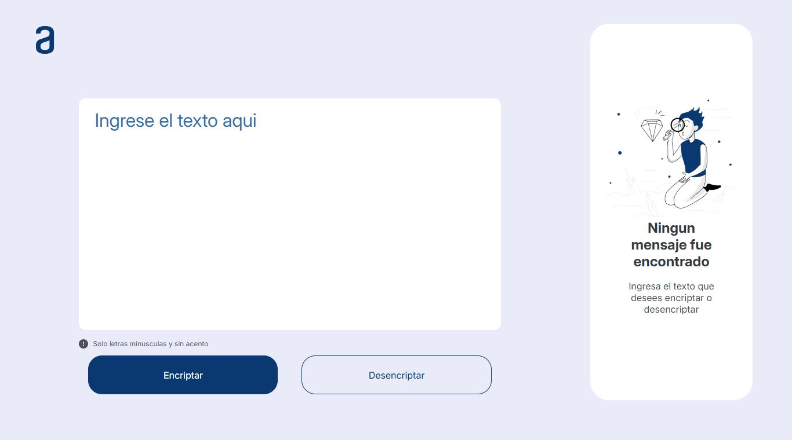
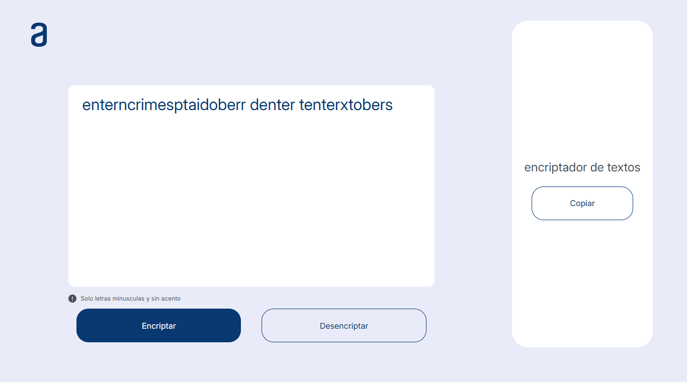

# Encriptador-de-textos

## Descripción

Este proyecto es una herramienta web interactiva para encriptar y desencriptar mensajes utilizando reglas simples de sustitución de caracteres. Permite a los usuarios transformar mensajes en texto encriptado que puede ser fácilmente desencriptado utilizando las mismas reglas. Es ideal para aprender sobre métodos básicos de encriptación o para divertirse encriptando mensajes secretos.

## Funcionalidades

### 1. Encriptación de Mensajes
- **Descripción**: Convierte las vocales del mensaje en cadenas de texto predefinidas según las siguientes reglas:
  - **`e`** se convierte en **`enter`**
  - **`i`** se convierte en **`imes`**
  - **`a`** se convierte en **`ai`**
  - **`o`** se convierte en **`ober`**
  - **`u`** se convierte en **`ufat`**
- **Uso**: Al presionar el botón "Encriptar", el texto ingresado en el área de texto se encripta automáticamente según las reglas anteriores.
- **Ejemplo**:  
  - **Entrada**: `hola`
  - **Salida**: `hoberlai`

### 2. Desencriptación de Mensajes
- **Descripción**: Reconvierte las cadenas de texto en las vocales originales utilizando las siguientes reglas inversas:
  - **`enter`** se convierte en **`e`**
  - **`imes`** se convierte en **`i`**
  - **`ai`** se convierte en **`a`**
  - **`ober`** se convierte en **`o`**
  - **`ufat`** se convierte en **`u`**
- **Uso**: Al presionar el botón "Desencriptar", el texto encriptado se transforma de vuelta a su forma original.
- **Ejemplo**:  
  - **Entrada**: `hoberlai`
  - **Salida**: `hola`

### 3. Copia de Resultados
- **Descripción**: Una vez que el mensaje ha sido encriptado o desencriptado, se muestra en la pantalla junto con un botón "Copiar", que permite copiar el texto al portapapeles.
- **Uso**: Presiona el botón "Copiar" para copiar el texto generado y utilizarlo en otro lugar.

